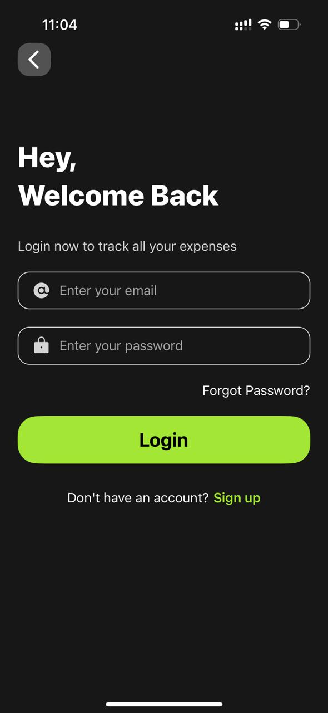
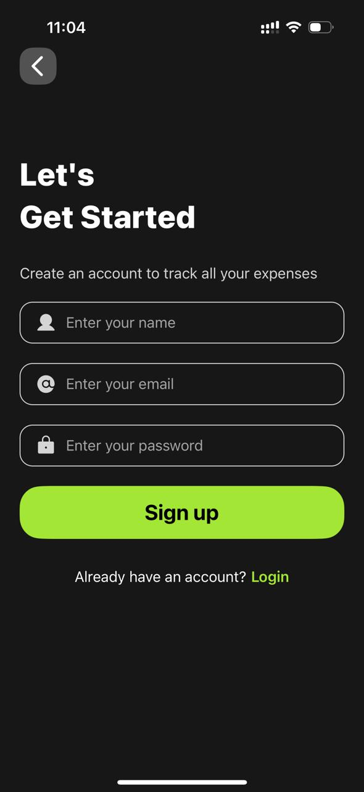
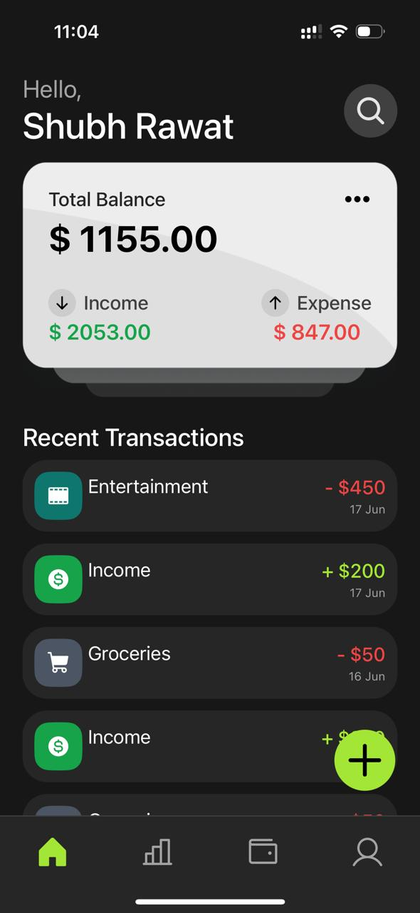
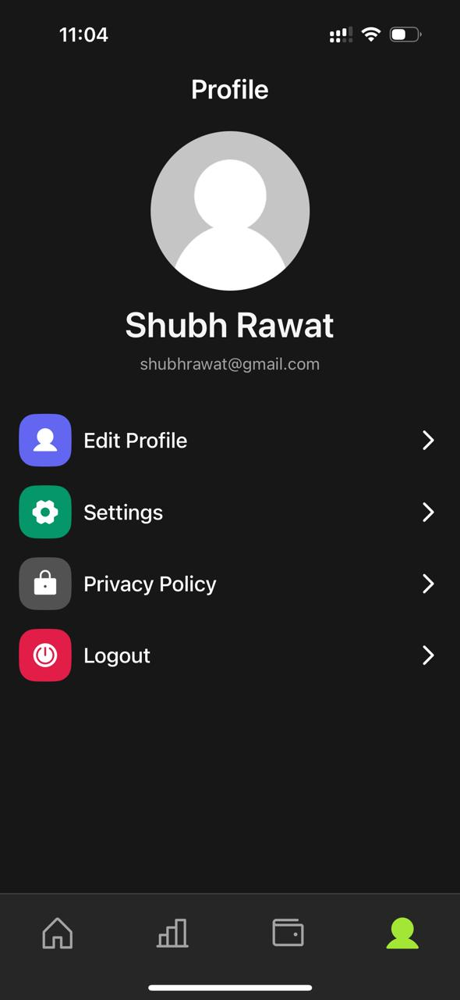
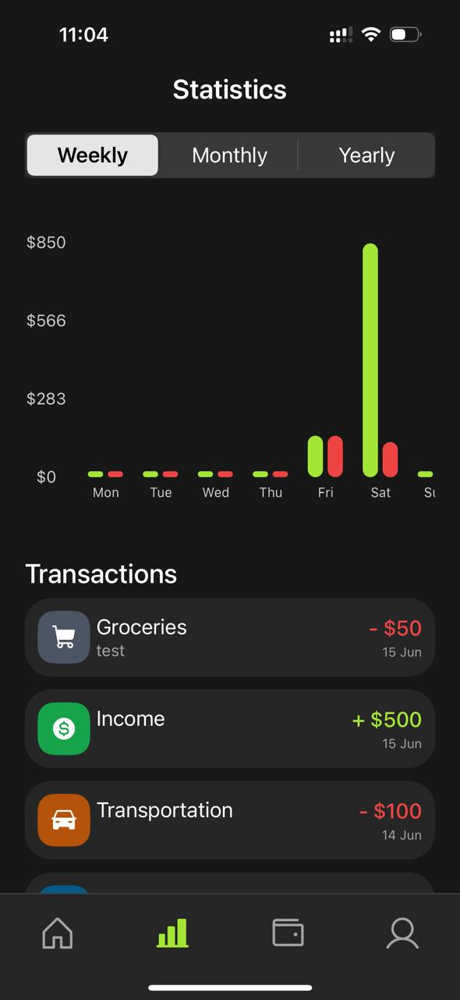
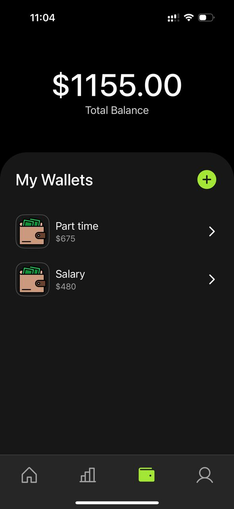

# 💸 Expense Tracker App

A full-featured cross-platform **Expense Tracker App** built with **React Native**, **Firebase**, and **Cloudinary** to help users manage personal finances effortlessly. It includes real-time updates, secure authentication, wallet and transaction management, statistics, and more.

---

## 🚀 Features

- 🔐 **Authentication**  
  Secure user registration and login using **Firebase Auth**.

- 🔄 **Real-Time Sync**  
  All data is updated in real-time via **Firebase Firestore**.

- 👤 **User Profile**  
  View and update your personal profile information.

- 👛 **Wallet Management**  
  Create, update, and track multiple wallets with current balances.

- 💵 **Transaction Handling**  
  Add, edit, delete transactions with support for income and expenses.

- 📈 **Statistics & Insights**  
  Visual graphs and stats to analyze spending habits.

- 🔍 **Search & Filter**  
  Quickly find past transactions using keywords or filters.

- 🖼️ **File Uploads**  
  Upload receipts and files via **Cloudinary**.

- 🧭 **Custom Tab Bar Navigation**  
  Smooth navigation with a stylish custom tab bar.

---

## 📱 Screenshots

  
  
  
  
  
  
  
  

---

## 🛠️ Tech Stack

- **Frontend:** React Native, Expo
- **Backend:** Firebase (Authentication + Firestore)
- **Media Storage:** Cloudinary
- **Navigation:** React Navigation
- **State Management:** Context API / React Hooks

---

